# Report for GSOC 2019

This page is the location for the reporting related to the GSoC 2019 project titled [A next-generation GUI for visualizing big gridded data in Python](https://github.com/ESIPFed/gsoc/issues/14) with the organisation [Earth Science Information Parteners](http://esipfed.org) and member organisation [US Geological Survey](https://www.usgs.gov/).

Student: [Harman Deep Singh](https://github.com/hdsingh) Mentors: [Rich Signell](https://github.com/rsignell-usgs), [Martin Durant](https://github.com/martindurant) ESIP POC: [Annie Bryant Burgess](https://github.com/abburgess)

| Project Details|  |
|---	|---	|
|Initial Proposal|  [Available here](https://drive.google.com/file/d/11EolJYYIAZWzo5FfrMRnKilAESub8wuf/view?usp=sharing)|
|Repository|[intake/xrviz](https://github.com/intake/xrviz)|
|Documentation|[xrviz.readthedocs.io](https://xrviz.readthedocs.io)|
|Milestones|  [#1](https://github.com/intake/intake-gsoc-gui/milestone/1), [#2](https://github.com/intake/intake-gsoc-gui/milestone/2), [#3](https://github.com/intake/intake-gsoc-gui/milestone/3), [#4](https://github.com/intake/intake-gsoc-gui/milestone/4) |
|Duration| ~4 Months (6 May'19 - 26 Aug'19)|

## Index
* [Community Bonding Period (May 6th - May 26th)](#community-bonding-period-may-6th---may-26th)
* [Coding Period (May 27 - Aug 26)](#coding-period-may-27---aug-26)
  + [Week 1 (May 27 - June 2)](#week-1-may-27---june-2)
  + [Week 2 (June 03 - June 09)](#week-2-june-03---june-09)
  + [Week 3 (June 10 - June 16)](#week-3-june-10---june-16)
  + [Week 4 (June 17 - June 23)](#week-4-june-17---june-23)
  + [Week 5 (June 24 - June 30)](#week-5-june-24---june-30)
  + [Week 6 (July 01 - July 07)](#week-6-july-01---july-07)
  + [Week 7 (July 08 - July 14)](#week-7-july-08---july-14)
  + [Week 8 (July 15 - July 21)](#week-8-july-15---july-21)
  + [Week 9 (July 22 - July 28)](#week-9-july-22---july-28)
  + [Week 10 (July 29 - Aug 04)](#week-10-july-29---aug-04)
  + [Week 11 (Aug 05 - Aug 11)](#week-11-aug-05---aug-11)
  + [Week 12 (Aug 12 - Aug 18)](#week-12-aug-12---aug-18)
* [Acknowledgment](#acknowledgment)

## Community Bonding Period (May 6th - May 26th)

[Community Bonding Period Milestone](https://github.com/intake/intake-gsoc-gui/milestone/1)

Activity:

1. Introduced myself and this project to the [ESIP](https://esip-all.slack.com/archives/C092JEU2C/p1557317043033200), [Intake](https://gitter.im/ContinuumIO/intake/archives/2019/05/18?at=5ce002d35b63ea22b3c8f337) and  [Pyviz](https://gitter.im/pyviz/pyviz/archives/2019/05/16?at=5cdcd628e7f42160fa982f7d) community.
2. Established [communication channel](https://gitter.im/ESIP_GUI/community) and had web meeting with mentors for discussion regarding workflow of the project.
3. Took overview of other catalog systems available. Watched [ESIP Tech Dive by Chris Holmes on STAC](https://www.youtube.com/watch?v=emXgkNutUTo).
4. Watched [ESIP Tech Dive talk on Intake](https://www.youtube.com/watch?v=PSD7r3JFml0).
5. Wrote the post [Beginning of my GSOC Journey!](https://hdsingh.github.io/pages/post1.html) ([Issue #4](https://github.com/intake/intake-gsoc-gui/issues/4)).
6. Set up development environment.
7. Tested use of catalogs with  [earlier dashboards](https://github.com/hdsingh/Dashboards) and discussed [Issue #3724 · pyviz/holoviews](https://github.com/pyviz/holoviews/issues/3724).
8. Read and executed the following documentations ([Issue #3](https://github.com/intake/intake-gsoc-gui/issues/3)):
    - [Xarray documentation](http://xarray.pydata.org/en/stable/)
    - [Intake documentation](https://intake.readthedocs.io/en/latest/)
    - [PyViz Tutorial — PyViz documentation](http://pyviz.org/tutorial/index.html)
    - [User Guide — HoloViews](http://holoviews.org/user_guide/index.html)
    - [Reference Guide — HoloViews](http://holoviews.org/reference/index.html)
    - [User Guide — GeoViews documentation](http://geoviews.org/user_guide/index.html)
    - [Gallery — GeoViews documentation](http://geoviews.org/gallery/index.html)
    - [User Guide — Panel documentation](https://pyviz-dev.github.io/panel/user_guide/index.html)
    - [Gallery — Panel](https://pyviz-dev.github.io/panel/gallery/index.html)
    - [User Guide — hvPlot](https://hvplot.pyviz.org/user_guide/index.html)

9. Explored Pangeo Datasets and Catalogs ([Issue #7](https://github.com/intake/intake-gsoc-gui/issues/7)).

10. I have also added `revising OOP Python concepts` to my studylist.

11. Prepared quick basic implementation of data description section ([Issue #5](https://github.com/intake/intake-gsoc-gui/issues/5#)).

Next week's Agenda:
- Discussion regarding design of [XrViz](https://github.com/intake/xrviz).
- Preparation of data input section.
- Learn using [Pytest](https://docs.pytest.org/en/latest/), which is going to be the testing framework for `XrViz`.

## Coding Period (May 27 - Aug 26)

### Week 1 (May 27 - June 2)

Weekly Activity

1. Took an overview of [Pytest](https://docs.pytest.org/en/latest/).
2. Understood working of `dfviz/widgets.py`.
3. Weekly e-meet: The following topics were discussed:
  - Tasks for Phase 1 (see [Phase I Milestone · GitHub](https://github.com/intake/intake-gsoc-gui/milestone/2)).
  - Tasks for week 1 in particular.
  - Working of  [Sigslot class](https://github.com/martindurant/dfviz/blob/master/dfviz/widget.py#L27).
4. Started implementation of Display and description section ([PR#2](https://github.com/intake/xrviz/pull/2)). Current status:

   1.Dimensions Display:
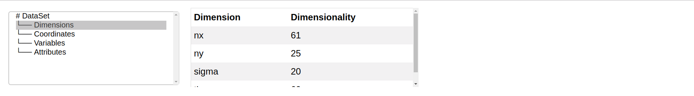

   2.Coordinates Display:


   3.Variables Display:
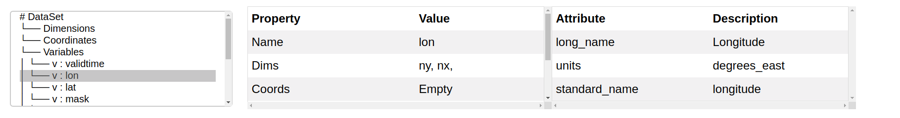

   4.Attributes Display:
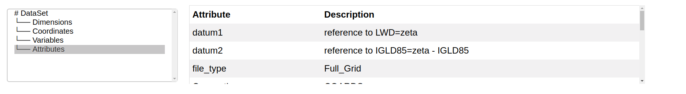

### Week 2 (June 03 - June 09)

Weekly Activity

1. Weekly e-meet: The following topics were discussed:
   - Appearance and functionality of display section. After discussion we concluded to have a simpler interface, displying only the `variables` in the selector. Other global properties would be always visible.
   - Overview and usage of tests.
   - Features and functionality of Fields panel.
2. Implemented simpler interface consisting of Display and description section ([PR #2](https://github.com/intake/xrviz/pull/2)). For more details please refer [Issue #14](https://github.com/intake/intake-gsoc-gui/issues/14) and [Issue #15](https://github.com/intake/intake-gsoc-gui/issues/14). Current status:

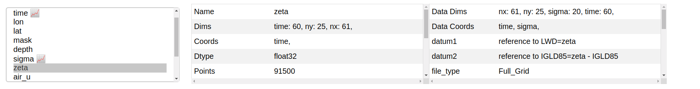
3. Started implementation of Basic Fields and Output Panel ([PR#3](https://github.com/intake/xrviz/pull/3)). Current status:

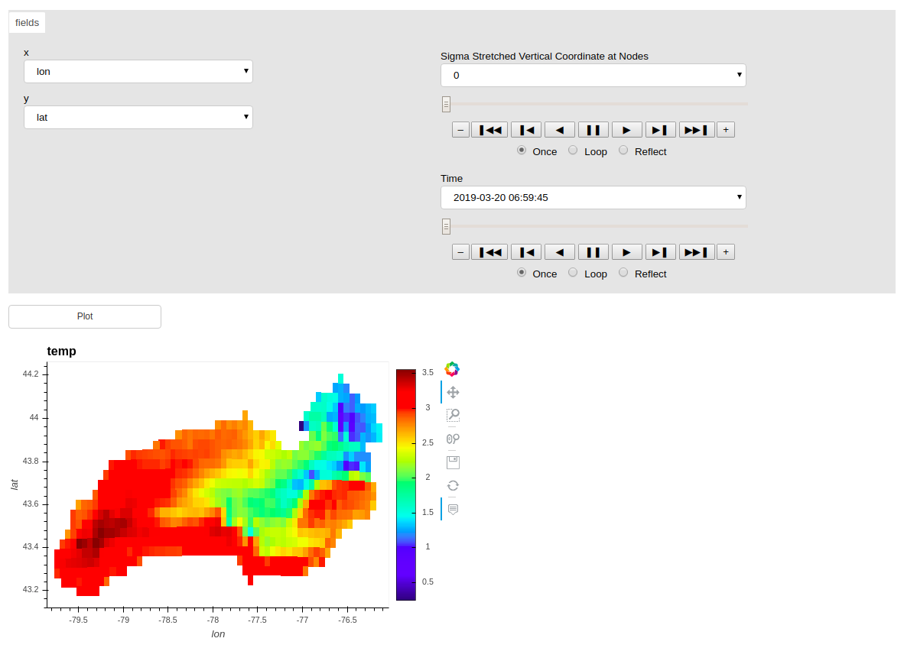


### Week 3 (June 10 - June 16)

Weekly Activity

1. Improved the Basic fields and output panel. Added support for plotting data coordinates with respect to variables, which earlier resulted in errors.
2. Completed implementation of Basic Fields and Output Panel ([PR #3](https://github.com/intake/xrviz/pull/3)). The plotting function has been reimplemented using `sel` method.
3. The following topics were discussed in weekly e-meet:
   - `ignore_events` method present in `dfviz`, can be useful for some interactions in `xrviz`.
   - Demonstrated the working of interface.
   - `convert_widget` function.
   - Way to set/reset variables to coordinates.
   - Aggregation methods ([Issue #21](https://github.com/intake/intake-gsoc-gui/issues/21))
   - Overview of tasks for Phase 2:
       - Style Panel ([Issue #22](https://github.com/intake/intake-gsoc-gui/issues/22))
       - Projection Panel ([Issue #23](https://github.com/intake/intake-gsoc-gui/issues/23))
       - Time series extraction ([Issue #24](https://github.com/intake/intake-gsoc-gui/issues/24))
4. Started implementation of Aggregations in the fields panel ([PR #4](https://github.com/intake/xrviz/pull/4)). Current Status:
  - For single selection

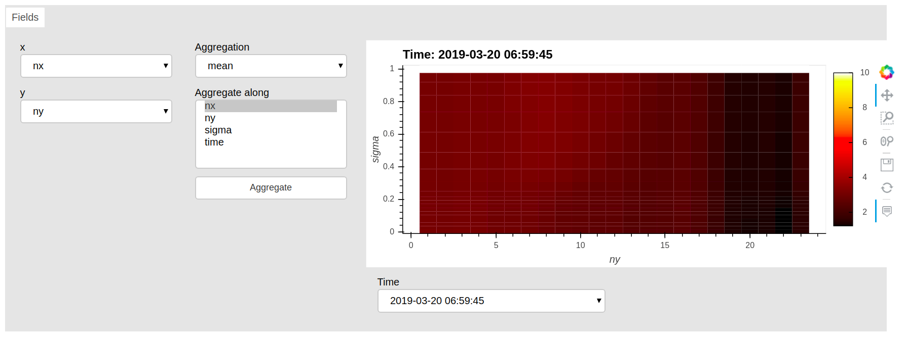

  - For multiple selections
   
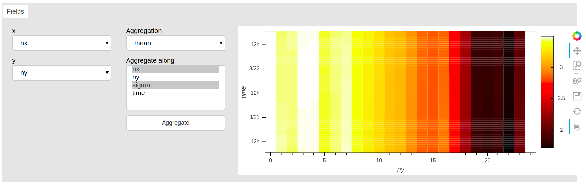
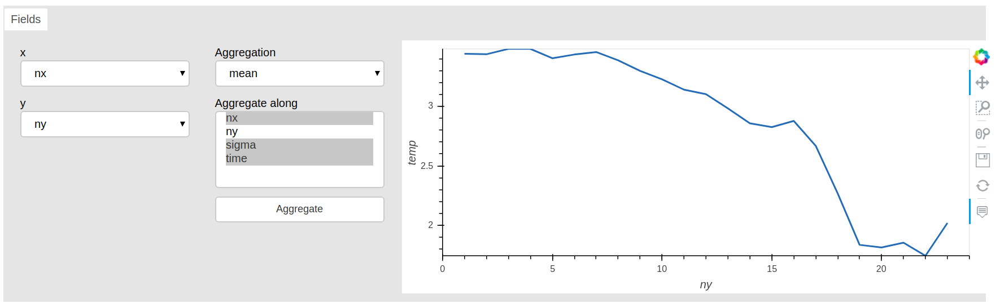

5. Started discussion to find out a possible solution to set and reset coordinates within the interface. For more details please refer [Issue #20](https://github.com/intake/intake-gsoc-gui/issues/20).


### Week 4 (June 17 - June 23)

Weekly Activity

1. Improved the functionality implemented earlier for Aggregations in the Fields panel. Now the user can aggregate along remaining dimensions (not selected in `x` and `y` ). The option to create a `Select` widget or `Animate` is also present in case the user does not wish to apply any aggregation on the dimension. ([PR #4](https://github.com/intake/xrviz/pull/4))

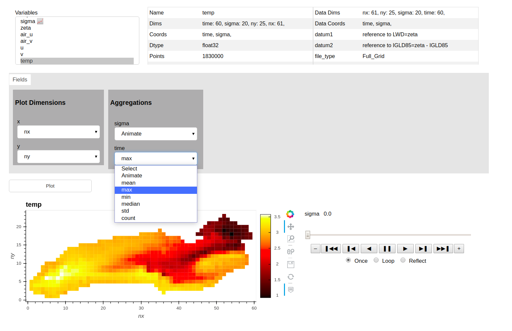

2. Implemented functionality to set reset coords ([PR #7](https://github.com/intake/xrviz/pull/7)). User can select and set any variable as a coordinate.

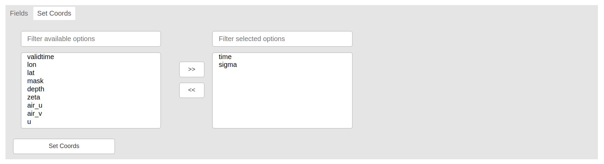

3. Modified set reset coords to work with aggregations. The user can have aggregation for a variable along a dimension, even when `x` and `y` Select has `coord` as options.

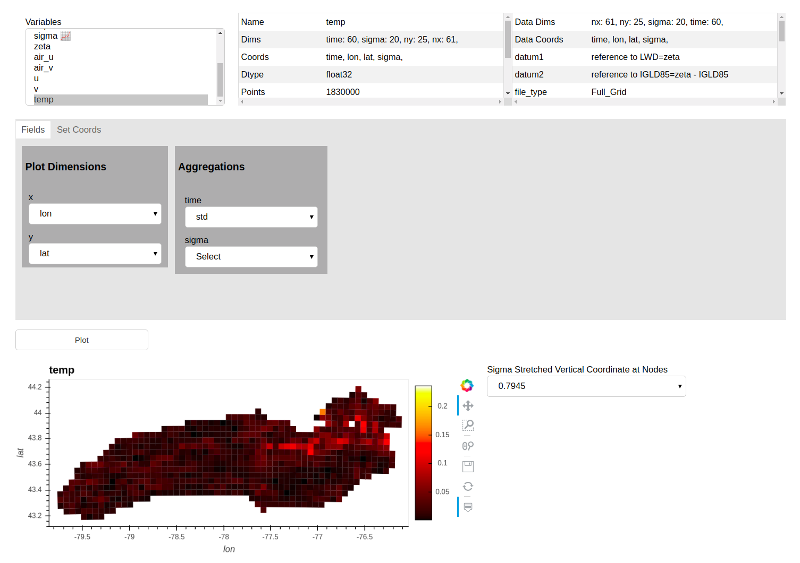

4. Weekly e-meet: The following topics were discussed:
  - Installation package ([PR #8588 · conda-forge](https://github.com/conda-forge/staged-recipes/pull/8588))
  - Demonstration of Aggregations ([PR #4](https://github.com/intake/xrviz/pull/4))
  - Demonstration of Set reset Coords ([PR #7](https://github.com/intake/xrviz/pull/7))
  - Discussed Tabular Rearrangement ([Issue #26](https://github.com/intake/intake-gsoc-gui/issues/26))
  - Generalisability of the interface: In future the dashboard can be used as base by the users, or community to visualise data related to a particular domain such as Astronomy, Oceanography by adding domian specific customisations.
5. XrViz can be installed as a package by `conda install -c conda-forge xrviz`. ([conda-forge/xrviz-feedstock](https://github.com/conda-forge/xrviz-feedstock))


### Week 5 (June 24 - June 30)

Weekly Activity

1. Rearranged panels into Tabs ([PR #12](https://github.com/intake/xrviz/pull/12)).
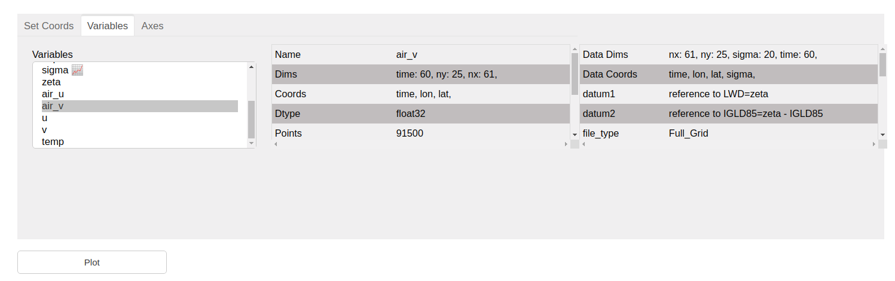

2. Started implementation of Style Panel ([PR #13](https://github.com/intake/xrviz/pull/13)).
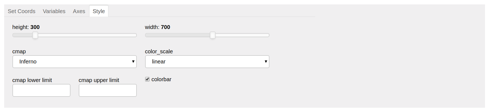

3. Started implementation of Projection Panel ([PR #14](https://github.com/intake/xrviz/pull/14)).
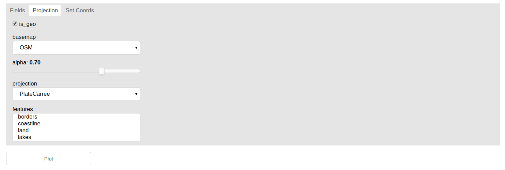

4. Weekly e-meet: The following topics were discussed:
   - Demonstrated interface after Tabular rearrangement.
   - Demonstrated Style Panel.
   - Demonstrated Projection Panel.
   - Changed topic for blogpost to “XrViz: An interactive visualisation interface for Xarrays”  ([Issue #9](https://github.com/intake/intake-gsoc-gui/issues/9#issuecomment-506765720)).
   - Enable Travis CI ([PR #15](https://github.com/intake/xrviz/pull/15#event-2445201688)).
5. Modified Style Panel according to the changes discussed.
6. BlogPost [XrViz: An interactive visualisation interface for Xarrays](https://medium.com/@hdsingh13/xrviz-an-interactive-visualisation-interface-for-xarrays-9ecf8e325aa9?source=friends_link&sk=a01204364cf9d123dcb4e89277a4a6cf).
7. Implemented `xrviz.example()`, so the following command can be used to try the interface([PR #20](https://github.com/intake/xrviz/pull/20#)).
```python
python -c "import xrviz; xrviz.example()"
```
8. Fixed pip installation( [PR #18](https://github.com/intake/xrviz/pull/18#)), which solved Colormap not found if installed from pip ([Issue #17](https://github.com/intake/xrviz/issues/17#issuecomment-507055551)).


### Week 6 (July 01 - July 07)

Weekly Activity

1. Completed implementation of Style Panel ([PR #13](https://github.com/intake/xrviz/pull/13)).
2. Modifed Projection Panel according to changes discussed in last e-meet ([PR #14](https://github.com/intake/xrviz/pull/14)).

With show_map (basemap):
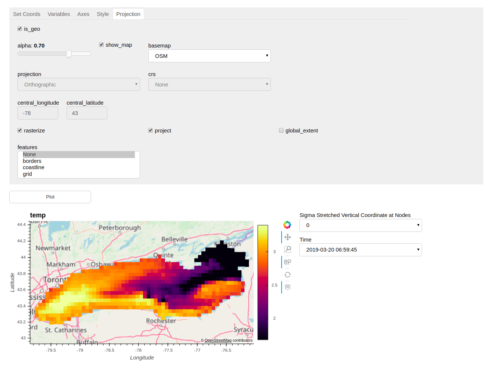

Without show_map (projection):
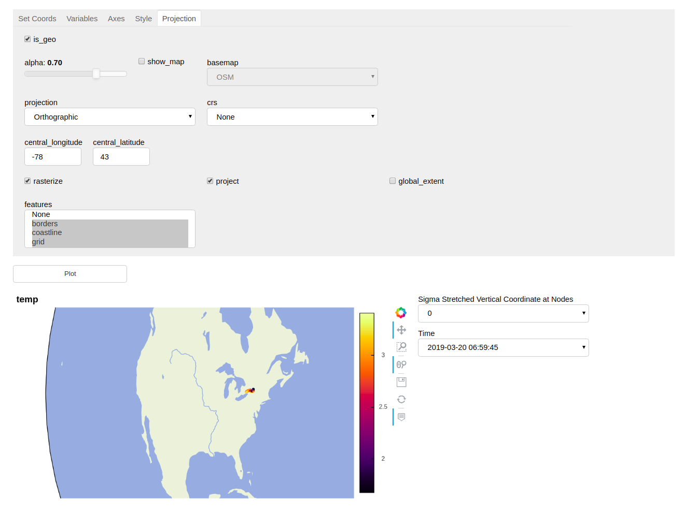

3. Weekly e-meet: The following topics were discussed:
   - Demonstrated changes made in Style Panel.
   - Demonstrated changes made in Projection Panel.
   - Tests to be implemented for Style, Projection and Dashboard.
   - Use of Coverage.


### Week 7 (July 08 - July 14)

Weekly Activity

1. Started implementation of Series Extraction ([Issue #24](https://github.com/intake/intake-gsoc-gui/issues/24)), (in branch [pre_series](https://github.com/hdsingh/xrviz/tree/pre_series), yet to create PR).
2. Weekly e-meet: The following topics were discussed:
   - Demonstrated changes made in Projection Panel
   - Passing of parameters to select values upon initialisation
   - Replace `central_latitude` and `central_longitude` widgets with `LiteralInput`.
   - Demonstrated recently started Series extraction feature.
3.  Completed  implementation of Projection Panel ([PR #14](https://github.com/intake/xrviz/pull/14)).

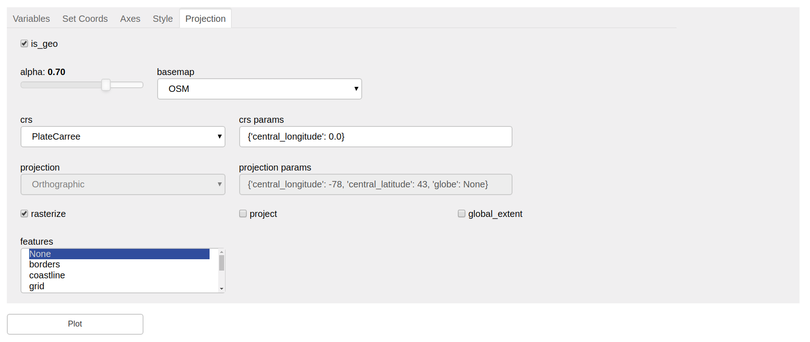

4. Started adding more tests (in branch [pre_tests_for_style_proj](https://github.com/hdsingh/xrviz/tree/pre_tests_for_style_proj), yet to create PR).


### Week 8 (July 15 - July 21)

Weekly Activity

1. Weekly e-meet: The following topics were discussed:
   - Minor changes to be made 
      - Rasterize in style panel
      - Textbox for crs and projections params instead of LiteralInput
      - Improve styling of displayer in Fields Panel
   - Demonstrated progress of Series Extraction feature.
   - Change of blogpost topic: "Amazing Pyviz" -> "Sigslot"
   - Good time to start documentation, will use [readthedocs](https://readthedocs.org/).
2. Minor changes added with `Change displayer width policy to min` ([PR #25](https://github.com/intake/xrviz/pull/25)) and `Urgent fixes` ([PR #28](https://github.com/intake/xrviz/pull/28)).
3. Added `Tests` ([PR #26](https://github.com/intake/xrviz/pull/26)), with coverage of 97%.
4. Improved Series extraction ([PR #27](https://github.com/intake/xrviz/pull/27)) by adding feature to extract along 2d coordinates and display information of other dimensions in hover.


5. Created [Explore-HRRR-with-XrViz](https://github.com/reproducible-notebooks/Explore-HRRR-with-XrViz), to demonstrate the progress of XrViz. Also deployed this notebook on [binder](https://aws-uswest2-binder.pangeo.io/v2/gh/reproducible-notebooks/Explore-HRRR-with-XrViz/master?filepath=HRRR_dashboard.ipynb).


### Week 9 (July 22 - July 28)

Weekly Activity

1. Completed Series extraction ([PR #27](https://github.com/intake/xrviz/pull/27)).
2. Weekly e-meet: The following topics were discussed:
   - Structure of and topics to cover in documentation.
   - Possible reasons behind faulty behaviour with COAWST dataset.
   - Presentation of XrViz to ESIP and Anaconda.
3. Published a blog post [Sigslot — A simple signalling mechanism for Panel](https://medium.com/@hdsingh13/sigslot-a-simple-signalling-mechanism-for-panel-e78de2f67d15?source=friends_link&sk=f66d3ba3dd5dcdb445dd366ebd098634).
4. Published a blog post [Let’s visualise big gridded data with Intake and XrViz](https://medium.com/@hdsingh13/lets-visualise-big-gridded-data-with-intake-and-xrviz-d1a90bb84fb2?source=friends_link&sk=4a8417b10c4065109fe21c1369a5db45).
5. Started writing documentation using Sphinx and Read the Docs ([PR #29](https://github.com/intake/xrviz/pull/29)).

### Week 10 (July 29 - Aug 04)

Weekly Activity

1. Weekly e-meet: The following topics were discussed:
   - The documentation should be short, clear and concise.
   - Schedule for presentation of Xrviz to Anaconda and ESIP.
2. Completed Initial Documentation ([PR #29](https://github.com/intake/xrviz/pull/29)). Docs are now available at [xrviz.readthedocs.io](https://xrviz.readthedocs.io/en/latest/).
3. Started improving documentation further ([PR #32](https://github.com/intake/xrviz/pull/32)).
4. Presented Xrviz in Anaconda Demo Friday.

### Week 11 (Aug 05 - Aug 11)

Weekly Activity

1. Completed improving documentation ([PR #32](https://github.com/intake/xrviz/pull/32)). 
2. Improved [README](https://github.com/intake/xrviz/blob/master/README.md) by adding badges and basic information ([PR #35](https://github.com/intake/xrviz/pull/35)).
3. Started looking into solution for issue: `quantile doesn't work for dask-powered xarrays` ([Issue #31](https://github.com/intake/xrviz/issues/31)) and attemped solving it in [PR #37](https://github.com/intake/xrviz/pull/37).

### Week 12 (Aug 12 - Aug 18)

Weekly Activity
1. Weekly e-meet: The following topics were discussed:
   - The dramatic slowness of XrViz when run within Intake ([PR #398 intake](https://github.com/intake/intake/pull/398))
   - GSOC Report and code submission.
   - Timings for presentation of XrViz to Pangeo.
2. Presented Xrviz to Pangeo in Weekly Meeting. A 10 minute demonstration of the interface.
3. Completed [PR #37](https://github.com/intake/xrviz/pull/37). Now users can also visualise dask xarrays.

## Acknowledgment

I am extremely grateful to my mentors Rich Signell and Martin Durant for helping me out at various stages throughout the summer. Special thanks to Annie Burgess, ESIP Lab Director for facilitating the Summer Program. Sincere gratitude to Google for offering me this great opportunity.

Working with ESIP, Intake and Pyviz under Google Summer of Code has been an amazing experience. This has given me a chance to learn more about creating interactive dashboards, python best practices, earth science, software development, open source and much more. I feel the project is in good state and would be extremely useful for the community.